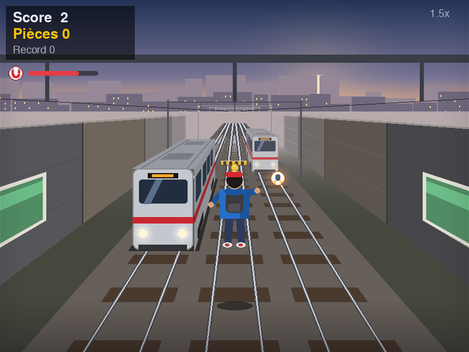

# Subway Python



Un jeu de course sur 3 voies en **pseudo-3D**, codé en Python avec Pygame. Le coureur est vu de dos. Il faut esquiver les trains, sauter les barrières basses et glisser sous les portiques, tout en ramassant pièces et bonus. La vitesse augmente au fil de la partie.

## Jouer

**Sans installer Python :** télécharge `SubwayPython.exe` dans l'onglet **Releases** du dépôt, puis double-clique dessus.

**Depuis le code :** double-clique sur `jouer.bat`. La première fois, le script installe tout seul ce qu'il faut (Python 3.10 ou plus est nécessaire). En ligne de commande :

```bash
pip install -r requirements.txt
python main.py
```

| Touche | Action |
|---|---|
| ← → (ou Q/A, D) | changer de voie |
| ↑ / Espace (ou Z/W) | sauter |
| ↓ (ou S) | glisser (en l'air : retombée rapide) |
| P / Échap | pause (automatique si tu changes de fenêtre) |
| F11 | plein écran |
| M | couper le son |

**Bonus** (comme dans le jeu original) :

| Bonus | Effet |
|---|---|
| Aimant | attire les pièces des autres voies pendant 8 s |
| Bouclier | encaisse un choc, puis invincibilité de 1,2 s |
| Jetpack | s'envole au-dessus des trains, invincible, avec une traînée de pièces |
| Score ×2 | double les points gagnés pendant 12 s |
| Super-baskets | sauts beaucoup plus hauts pendant 12 s |

## Rendu

- **Caméra en perspective** derrière le coureur, qui suit ses changements de voie en douceur, avec un effet de secousse au moment du choc.
- **Brouillard atmosphérique** : les objets sortent de la brume au loin. Ciel au coucher du soleil avec une silhouette de ville.
- **Trains en volume** (face avant, flanc, toit, fenêtres, phares allumés) et ombres portées. Décor qui défile : traverses, caténaires, murs avec affiches.
- **Coureur animé vu de dos** : course, saut, glissade, bulle du bouclier. Pièces qui tournent sur elles-mêmes.
- Tout est dessiné par le code : aucune image ni aucun son externe.

## Architecture

```
main.py            boucle principale (delta-time, fenêtre redimensionnable)
src/config.py      constantes (voies, physique, difficulté, bonus)
src/entities.py    Player, Obstacle, Coin, PowerUp : logique pure
src/world.py       défilement, génération procédurale, collisions, bonus, score
src/render3d.py    projection en perspective, brouillard, décor, trains, coureur
src/game.py        états (menu / jeu / pause / game over), HUD, particules
src/assets.py      icônes de bonus et sons générés
src/storage.py     sauvegarde JSON (record, pièces, parties)
```

La logique du jeu reste en 2D vue de dessus : chaque objet a une voie et une position. `render3d.py` transforme cette position en profondeur, puis la projette à l'écran. Grâce à cette séparation, les règles se testent sans fenêtre.

## Tests et build

```bash
pip install -r requirements.txt -r requirements-dev.txt
python -m pytest            # 17 tests : collisions, génération, bonus, jetpack, sauvegarde
```

À chaque push, GitHub Actions lance les tests puis construit `SubwayPython.exe` sous Windows. Un tag `v*` publie l'exécutable dans les Releases. Pour construire l'exécutable localement, utilise `construire_exe.bat`.

Pour publier le dépôt : `publier_sur_github.bat` (nécessite Git et GitHub CLI).

## Licence

MIT
